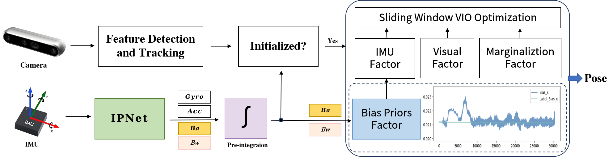
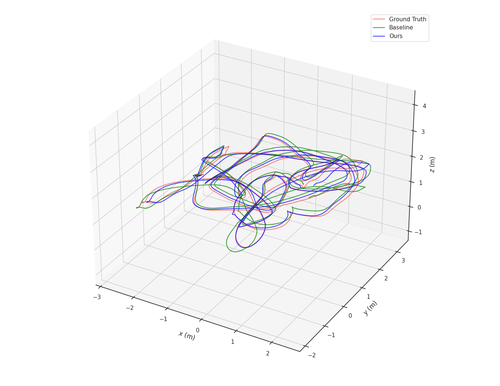
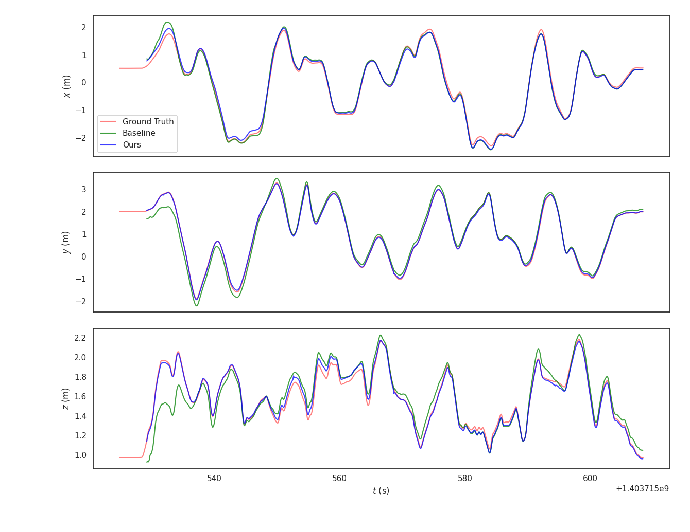
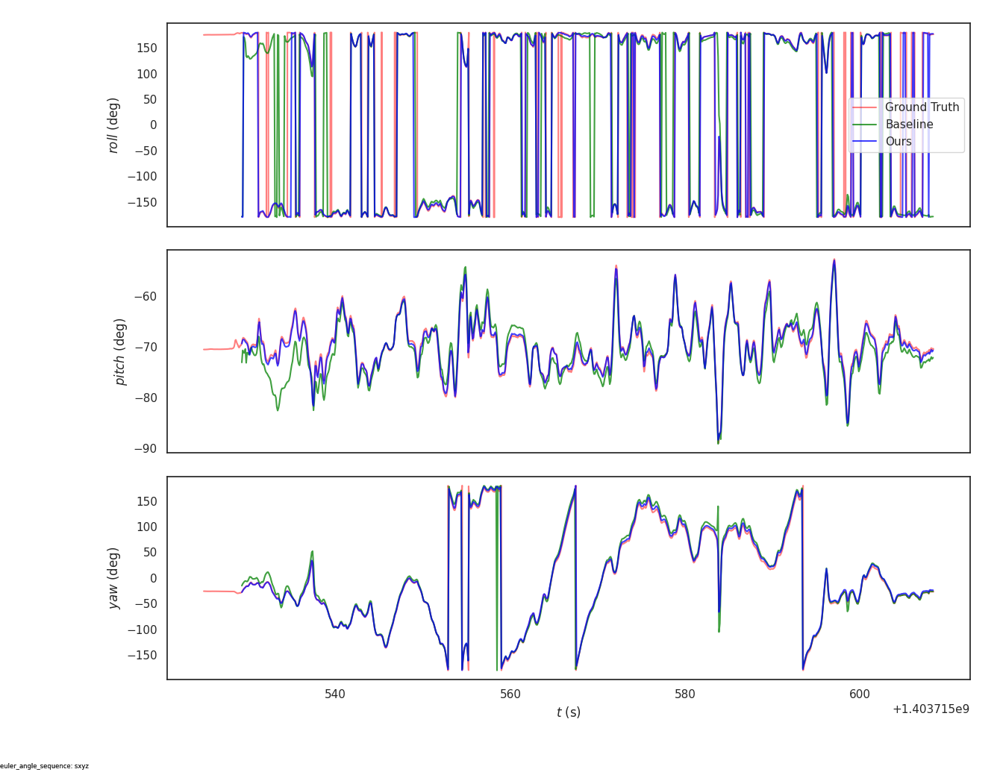

  <h1>A Plug-and-Play Learning-based IMU Bias Factor for Robust Visual-Inertial Odometry</h1>

> **A Plug-and-Play Learning-based IMU Bias Factor for Robust Visual-Inertial Odometry** 
> Yang Yi, Kunqing Wang, Jinpu Zhang, Zhen Tan, Xiangke Wang, Hui Shen and Dewen Hu 
> National University of Defense Technology, China. 
> [**arXiv 2025**](http://arxiv.org/abs/2503.12527) 

##  TL;DR

The bias of low-cost Inertial Measurement Units (IMU) can be estimated using Visual-Inertial Odometry (VIO) by combining constraints from visual features and inertial measurements. However, the precision of this bias estimation is highly dependent on the quality of the visual features. When visual tracking encounters errors, the bias optimization results can deviate significantly from the real values, compromising system stability and localization precision. In this paper, we propose a novel framework featuring a plug-and-play learning-based IMU bias factor, with its core being the Inertial Prior Network (IPNet). Recognizing the substantial impact of initial bias errors in low-cost inertial devices on system performance, our network directly leverages raw IMU data to estimate the mean bias, eliminating the dependency on historical bias values and effectively preventing error propagation. Furthermore, to overcome the challenge posed by the lack of bias labels in many visual-inertial datasets, we introduce an iterative approach to calculate the mean value of the bias. 

## Overview

## Robustness Evaluation (click for video)

|              Seq.               |                           Baseline                           |                             Ours                             |
| :-----------------------------: | :----------------------------------------------------------: | :----------------------------------------------------------: |
|          V2_02(Euroc)           | <video width="640" height="360" controls>   <source src="Video/V2_02.mp4" type="video/mp4">   V2_02. </video> | <video width="640" height="360" controls>   <source src="Video/V2_02_Ours.mp4" type="video/mp4">   V2_02_Ours. </video> |
|          room5(TumVI)           | <video width="640" height="360" controls>   <source src="Video/room5.mp4" type="video/mp4">   room5. </video> | <video width="640" height="360" controls>   <source src="Video/room5_Ours.mp4" type="video/mp4">   room5_Ours. </video> |
| seq04(A self-collected dataset) | <video width="640" height="360" controls>   <source src="Video/seq04.mp4" type="video/mp4">   seq04. </video> | <video width="640" height="360" controls>   <source src="Video/seq04_Ours.mp4" type="video/mp4">   seq04_Ours. </video> |

## Localization Precision Evaluation(taking V1_02 as an example)

|  |
| :----------------------------------------------------------: |
|  |
|  |

## Acknowledgement

This work is build upon VINS-Fusion (https://github.com/HKUST-Aerial-Robotics/VINS-Fusion). 

