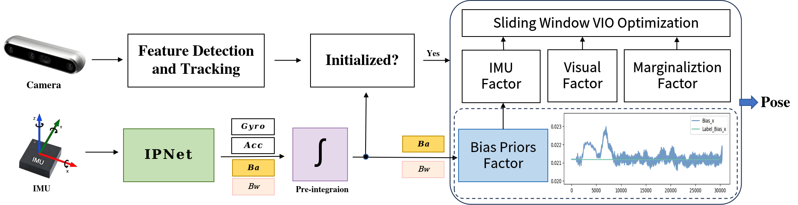
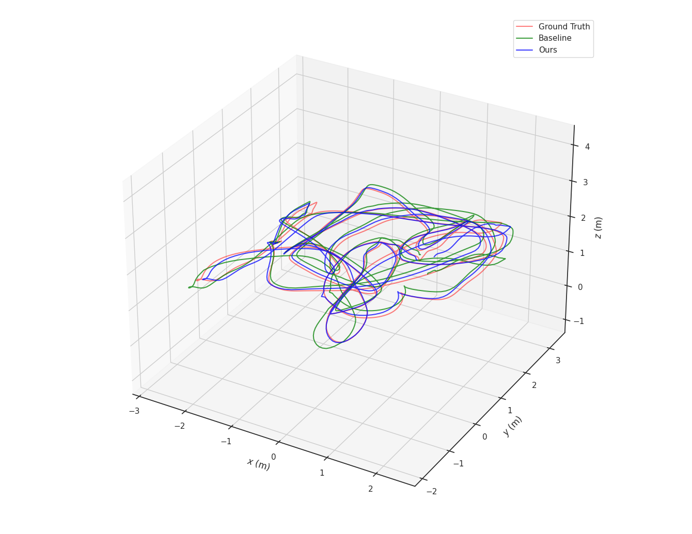
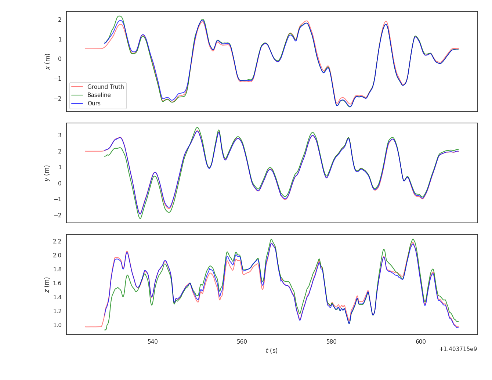
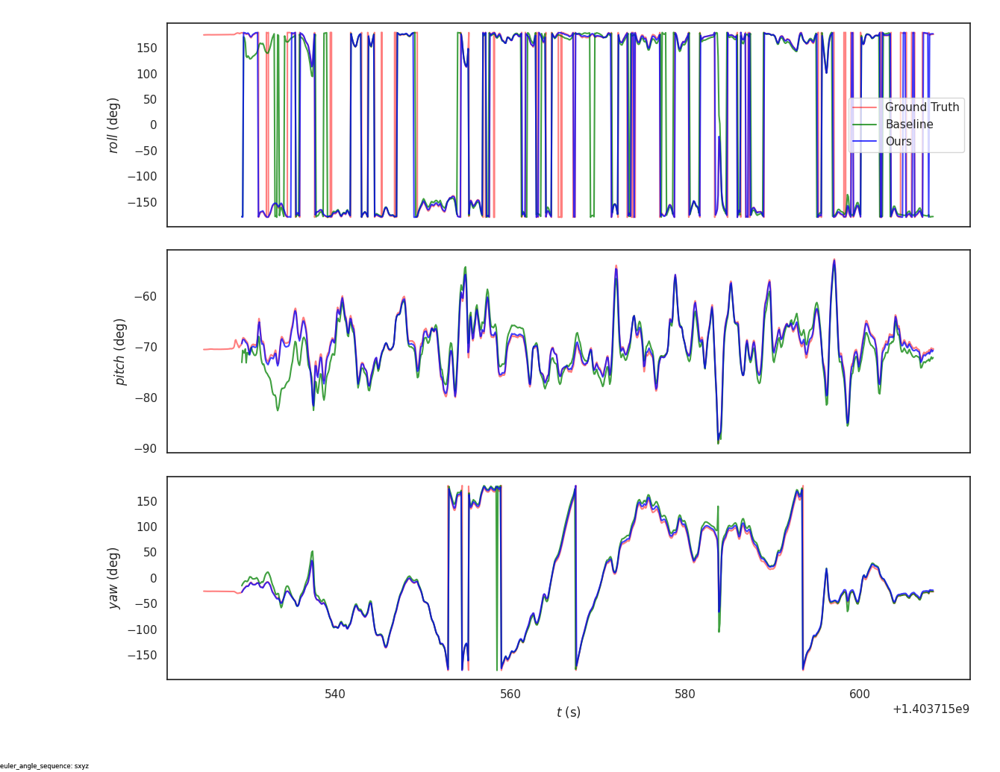

  <h1>A Plug-and-Play Learning-based IMU Bias Factor for Robust Visual-Inertial Odometry</h1>

> **A Plug-and-Play Learning-based IMU Bias Factor for Robust Visual-Inertial Odometry** 
> Yang Yi, Kunqing Wang, Jinpu Zhang, Zhen Tan, Xiangke Wang, Hui Shen and Dewen Hu 
> National University of Defense Technology, China. 
> [**arXiv 2025**](http://arxiv.org/abs/2503.12527) 

To do：
- [ ] Evaluation code for IPNet.
- [ ] Trained model and IMU bias labels.
- [ ] Training code.

## News
- **March 2026**: Accepted in IEEE Transactions on Instrumentation & Measurement.

##  TL;DR

Accurate and reliable estimation of biases of low-cost Inertial Measurement Units (IMU) is a key factor to maintain the resilience of Visual-Inertial Odometry (VIO), particularly when visual tracking fails in challenging areas. To address the issue of inaccurate estimation of low-cost IMU bias resulting from visual tracking failures, we propose an Inertial Prior Network (IPNet), a plug-and-play module that captures platform-specific motion characteristics directly from raw IMU measurements to infer bias priors. This approach eliminates the dependency on recursive bias estimation combining visual features, thus effectively preventing error propagation in challenging areas. Additionally, to compensate for the scarcity of ground-truth bias in most visual-inertial datasets, we introduce an iterative method to compute the mean IMU bias for each sequence to facilitate network training. Extensive experimental results on the EuRoC and TumVi public datasets, as well as an in-house dataset, demonstrate that the IPNet significantly enhances localization precision and robustness. Specifically,on the public benchmarks, the average improvements in ATE-RMSE and RPE-RMSE reached 46\% and 48\%, respectively. Moreover, the model’s cross-scene generalization is confirmed by successfully applying the indoor-trained prior network to outdoor autonomous driving scenarios.

## Overview

## Robustness Evaluation (click for video)

|              Seq.               |                           Baseline                           |                             Ours                             |
| :-----------------------------: | :----------------------------------------------------------: | :----------------------------------------------------------: |
|          V2_02(Euroc)           | <video width="640" height="360" controls>   <source src="Video/V2_02.mp4" type="video/mp4">   V2_02. </video> | <video width="640" height="360" controls>   <source src="Video/V2_02_Ours.mp4" type="video/mp4">   V2_02_Ours. </video> |
|          room5(TumVI)           | <video width="640" height="360" controls>   <source src="Video/room5.mp4" type="video/mp4">   room5. </video> | <video width="640" height="360" controls>   <source src="Video/room5_Ours.mp4" type="video/mp4">   room5_Ours. </video> |
| seq04(A self-collected dataset) | <video width="640" height="360" controls>   <source src="Video/seq04.mp4" type="video/mp4">   seq04. </video> | <video width="640" height="360" controls>   <source src="Video/seq04_Ours.mp4" type="video/mp4">   seq04_Ours. </video> |

## Localization Precision Evaluation(taking V1_02 as an example)

|  |
| :----------------------------------------------------------: |
|  |
|  |

## Acknowledgement

This work is build upon VINS-Fusion (https://github.com/HKUST-Aerial-Robotics/VINS-Fusion). 

